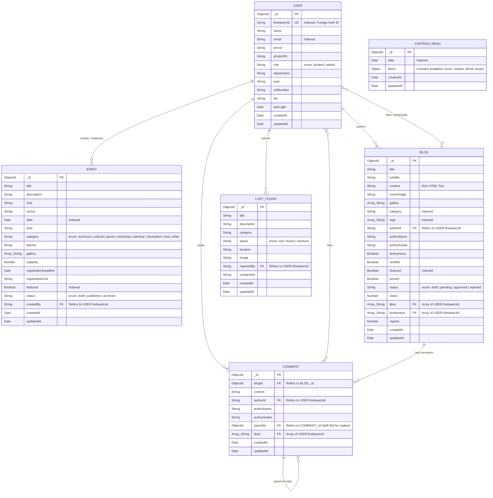

# CampusConnect — Entity-Relationship (ER) Diagram

This document describes the complete database schema for **CampusConnect**, illustrating all MongoDB collections, attributes, primary/foreign keys, and relational cardinality.

---

## 📊 Visual ER Diagram (Mermaid)

---

## 🗂️ Entity Catalog & Schema Details

### 1. `users` Collection
*Stores student and administrator accounts synced between Firebase Auth and MongoDB.*

| Field | Type | Constraint / Index | Description |
|-------|------|--------------------|-------------|
| `_id` | `ObjectId` | Primary Key | Auto-generated MongoDB unique identifier |
| `firebaseUid` | `String` | Unique, Indexed | Foreign Key linking to Firebase Authentication UID |
| `name` | `String` | Required | Full display name of the user |
| `email` | `String` | Required, Indexed | User email address |
| `phone` | `String` | Optional | User phone number |
| `photoURL` | `String` | Optional | Profile avatar image URL |
| `role` | `String` | Enum (`student`, `admin`) | Role-based authorization tier |
| `department` | `String` | Optional | Academic department (e.g., Computer Engineering) |
| `year` | `String` | Optional | Academic year (e.g., FE, SE, TE, BE) |
| `rollNumber` | `String` | Optional | University roll number |
| `bio` | `String` | Optional | Short user bio |
| `lastLogin` | `Date` | Timestamp | Date of last authentication session |
| `createdAt` | `Date` | Timestamp | Document creation timestamp |
| `updatedAt` | `Date` | Timestamp | Document modification timestamp |

---

### 2. `events` Collection
*Stores university events, workshops, hackathons, and cultural fests.*

| Field | Type | Constraint / Index | Description |
|-------|------|--------------------|-------------|
| `_id` | `ObjectId` | Primary Key | Unique Event ID |
| `title` | `String` | Required | Event title |
| `description` | `String` | Required | Detailed event description |
| `club` | `String` | Required | Organizing club or department |
| `venue` | `String` | Required | Physical or online location |
| `date` | `Date` | Required, Indexed | Event start date |
| `time` | `String` | Required | Event time (e.g., `09:00 AM`) |
| `category` | `String` | Enum (`technical`, `cultural`, etc.) | Categorization tag |
| `banner` | `String` | Optional | Banner image URL |
| `gallery` | `Array[String]` | Optional | Array of gallery image URLs |
| `capacity` | `Number` | Optional | Maximum seat count |
| `registrationDeadline` | `Date` | Optional | Registration deadline timestamp |
| `registrationLink` | `String` | Optional | External registration link |
| `featured` | `Boolean` | Indexed | Whether showcased on hero/dashboard |
| `status` | `String` | Enum (`draft`, `published`, `archived`) | Lifecycle state |
| `createdBy` | `String` | Foreign Key (`users.firebaseUid`) | Organizer UID |
| `createdAt` | `Date` | Timestamp | Created timestamp |
| `updatedAt` | `Date` | Timestamp | Updated timestamp |

---

### 3. `blogs` Collection
*Stores student and faculty blogs, articles, and stories.*

| Field | Type | Constraint / Index | Description |
|-------|------|--------------------|-------------|
| `_id` | `ObjectId` | Primary Key | Unique Blog ID |
| `title` | `String` | Required | Article headline |
| `subtitle` | `String` | Optional | Brief summary deck |
| `content` | `String` | Required | Full rich-text HTML content |
| `coverImage` | `String` | Optional | Main article image URL |
| `category` | `String` | Indexed | Category (e.g., Technology, Campus Life) |
| `tags` | `Array[String]` | Indexed | Searchable tag strings |
| `authorId` | `String` | Foreign Key (`users.firebaseUid`) | Author's Firebase UID |
| `authorName` | `String` | Required | Author name (or 'Anonymous') |
| `authorAvatar` | `String` | Optional | Author avatar URL |
| `anonymous` | `Boolean` | Default: `false` | If author identity is hidden |
| `verified` | `Boolean` | Default: `false` | Verified author badge |
| `featured` | `Boolean` | Indexed | Featured post flag |
| `pinned` | `Boolean` | Default: `false` | Pinned to top of feed |
| `status` | `String` | Enum (`pending`, `approved`, `rejected`) | Admin moderation state |
| `views` | `Number` | Default: `0` | Article view count |
| `likes` | `Array[String]` | Array of FK (`users.firebaseUid`) | Array of user UIDs who liked |
| `bookmarks` | `Array[String]` | Array of FK (`users.firebaseUid`) | Array of user UIDs who bookmarked |
| `reports` | `Number` | Default: `0` | Community report flag count |
| `createdAt` | `Date` | Timestamp | Creation timestamp |
| `updatedAt` | `Date` | Timestamp | Last modified timestamp |

---

### 4. `comments` Collection
*Stores comments and nested threaded replies for blogs.*

| Field | Type | Constraint / Index | Description |
|-------|------|--------------------|-------------|
| `_id` | `ObjectId` | Primary Key | Unique Comment ID |
| `blogId` | `ObjectId` | Foreign Key (`blogs._id`), Indexed | Target blog post |
| `content` | `String` | Required | Comment body text |
| `authorId` | `String` | Foreign Key (`users.firebaseUid`) | Commenter UID |
| `authorName` | `String` | Required | Commenter name |
| `authorAvatar` | `String` | Optional | Commenter avatar URL |
| `parentId` | `ObjectId` | Self-Ref Foreign Key (`comments._id`) | Null for top-level, else parent comment ID |
| `likes` | `Array[String]` | Array of FK (`users.firebaseUid`) | User UIDs who liked this comment |
| `createdAt` | `Date` | Timestamp | Creation timestamp |
| `updatedAt` | `Date` | Timestamp | Last modified timestamp |

---

### 5. `lostfounds` Collection
*Stores reported lost and found campus items (Teammate Module).*

| Field | Type | Constraint / Index | Description |
|-------|------|--------------------|-------------|
| `_id` | `ObjectId` | Primary Key | Unique item ID |
| `title` | `String` | Required | Item title (e.g., "Blue Water Bottle") |
| `description` | `String` | Required | Item description & details |
| `category` | `String` | Required | Electronics, Books, Accessories, etc. |
| `status` | `String` | Enum (`lost`, `found`, `resolved`) | Item recovery status |
| `location` | `String` | Required | Campus location where item was seen/lost |
| `image` | `String` | Optional | Item photo URL |
| `reportedBy` | `String` | Foreign Key (`users.firebaseUid`) | Reporter UID |
| `contactInfo` | `String` | Required | Phone number or email for recovery |
| `createdAt` | `Date` | Timestamp | Created timestamp |
| `updatedAt` | `Date` | Timestamp | Updated timestamp |

---

### 6. `canteenmenus` Collection
*Stores daily mess and canteen food menus (Teammate Module).*

| Field | Type | Constraint / Index | Description |
|-------|------|--------------------|-------------|
| `_id` | `ObjectId` | Primary Key | Unique menu record ID |
| `date` | `Date` | Indexed | Target date of menu |
| `items` | `Object` | Embedded Document | Map of meal slots (`breakfast`, `lunch`, `snacks`, `dinner`) containing array of `CCMenuItem` objects |
| `createdAt` | `Date` | Timestamp | Created timestamp |
| `updatedAt` | `Date` | Timestamp | Updated timestamp |

---

## 🔗 Relationships Summary Table

| Source Entity | Target Entity | Relationship Type | Key Reference | Description |
|---------------|---------------|-------------------|---------------|-------------|
| **`USER`** | **`EVENT`** | One-to-Many ($1:N$) | `EVENT.createdBy` $\rightarrow$ `USER.firebaseUid` | A user (organizer) creates multiple events. |
| **`USER`** | **`BLOG`** | One-to-Many ($1:N$) | `BLOG.authorId` $\rightarrow$ `USER.firebaseUid` | A user writes multiple blog posts. |
| **`USER`** | **`COMMENT`** | One-to-Many ($1:N$) | `COMMENT.authorId` $\rightarrow$ `USER.firebaseUid` | A user posts multiple comments. |
| **`USER`** | **`LOST_FOUND`** | One-to-Many ($1:N$) | `LOST_FOUND.reportedBy` $\rightarrow$ `USER.firebaseUid` | A user reports lost or found items. |
| **`BLOG`** | **`COMMENT`** | One-to-Many ($1:N$) | `COMMENT.blogId` $\rightarrow$ `BLOG._id` | A blog post contains multiple comments. |
| **`COMMENT`** | **`COMMENT`** | Self-Referencing ($1:N$) | `COMMENT.parentId` $\rightarrow$ `COMMENT._id` | A comment can be a reply to another comment. |
| **`USER`** | **`BLOG`** | Many-to-Many ($M:N$) | `BLOG.likes` $\rightarrow$ `USER.firebaseUid[]` | Users like multiple blogs; blogs receive likes from multiple users. |
| **`USER`** | **`BLOG`** | Many-to-Many ($M:N$) | `BLOG.bookmarks` $\rightarrow$ `USER.firebaseUid[]` | Users bookmark multiple blogs for reading later. |